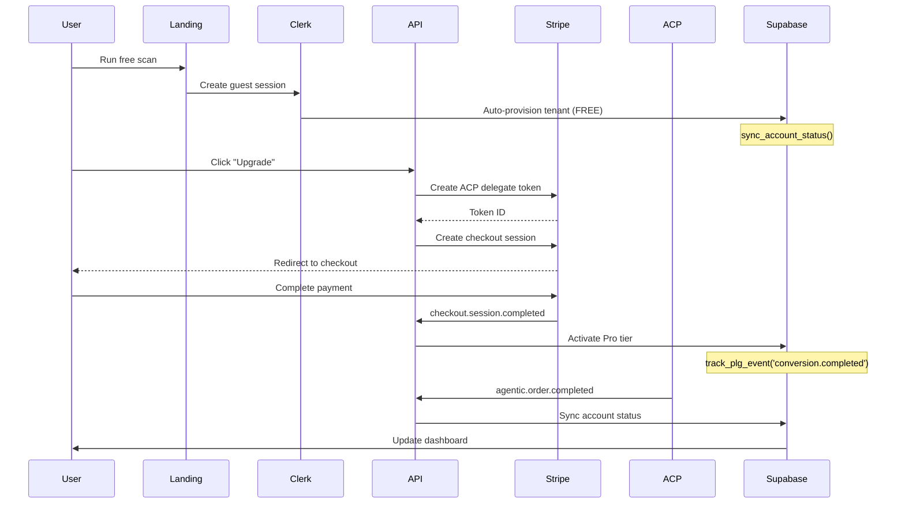

# ACP-Enabled PLG Integration - Implementation Summary

**Date**: 2025-11-01
**Branch**: `feature/orchestrator-diagnostics-ai-scores-clean`
**Status**: ✅ **COMPLETE**

---

## Overview

Successfully implemented a complete **Agentic Commerce Protocol (ACP)** integration with a **Product-Led Growth (PLG)** funnel spanning all four phases:

1. **Discover** - Lead capture with Clerk guest sessions
2. **Try** - Trial activation via Stripe
3. **Buy** - Agent/user conversion with ACP checkout
4. **Retain** - Usage tracking and churn prevention

---

## Implementation Summary

### 📁 Files Created

| File | Purpose |
|------|---------|
| `supabase/migrations/20251101000000_acp_plg_integration.sql` | Complete schema with 6 tables, 4 functions, RLS policies |
| `app/api/webhooks/acp/route.ts` | ACP webhook handler for agentic orders |
| `app/api/checkout/session/route.ts` | Checkout session creation with ACP delegate tokens |
| `app/api/plg/metrics/route.ts` | PLG metrics API (GET/POST) |
| `app/api/plg/events/route.ts` | PLG events API (GET/POST) |
| `docs/ACP_PLG_INTEGRATION.md` | Comprehensive 400+ line documentation |

### 🔧 Files Modified

| File | Changes |
|------|---------|
| `app/api/stripe/webhook/route.ts` | Added Supabase sync for checkout, trial, churn events |
| `app/api/clerk/webhook/route.ts` | Added tenant auto-provisioning and PLG event tracking |

---

## Database Schema

### Tables Created

1. **`tenants`** - Multi-tenant account management
   - Tracks plan (FREE/PRO/ENTERPRISE), status, Stripe IDs
   - RLS enabled for data isolation

2. **`orders`** - Order tracking for Stripe and ACP purchases
   - Captures amount, currency, source (stripe/agentic)
   - ACP token tracking, status workflow

3. **`events`** - Audit log for all lifecycle events
   - User actions across PLG funnel
   - Source tracking (clerk, stripe, acp, manual)

4. **`pulse_events`** - Real-time dashboard feed
   - Live event stream for dashboard UI
   - Filtered by user and event type

5. **`plg_metrics`** - Aggregated KPI metrics
   - Named metrics with values and JSON data
   - Time-series tracking

6. **`kpi_daily`** - Daily rollup of key metrics
   - Signups, trials, paid, acp_orders
   - Calculated rates (activation, trial-to-paid, ACR)
   - MRR and churn tracking

### Functions Created

1. **`sync_account_status(event JSONB)`**
   - Syncs tenant state from webhook events
   - Upserts tenant record, inserts event log
   - Called by Stripe, ACP, and Clerk webhooks

2. **`track_plg_event(user_id, event_type, source, event_data)`**
   - Tracks funnel events
   - Updates daily KPI rollups atomically
   - Inserts into both `events` and `pulse_events`

3. **`calculate_activation_rate(start_date, end_date)`**
   - Calculates paid/total conversion rate
   - Returns percentage (0-100)

4. **`calculate_mrr()`**
   - Sums all active subscription amounts
   - Returns MRR in cents

---

## API Endpoints

### Checkout & Webhooks

#### `POST /api/checkout/session`
Creates Stripe Checkout Session with ACP delegate token.

**Request**:
```json
{
  "plan": "pro",
  "domain": "dealer.com",
  "company": "Example Dealership"
}
```

**Response**:
```json
{
  "url": "https://checkout.stripe.com/xxx",
  "sessionId": "cs_xxx",
  "acpTokenId": "spt_tok_xxx"
}
```

#### `POST /api/webhooks/acp`
Handles ACP webhook events:
- `agentic.order.created`
- `agentic.order.completed`
- `agentic.order.canceled`
- `agentic.order.refunded`

Includes HMAC SHA-256 signature verification.

#### `POST /api/stripe/webhook`
Enhanced to sync with Supabase:
- `checkout.session.completed` → Activate Pro tier
- `customer.subscription.created` → Track trial start
- `customer.subscription.deleted` → Track churn

#### `POST /api/clerk/webhook`
Enhanced to auto-provision tenants:
- `user.created` → Create tenant, track signup event

### PLG Metrics

#### `GET /api/plg/metrics`
Retrieves aggregated PLG metrics.

**Query Parameters**:
- `startDate` - ISO date (default: 30 days ago)
- `endDate` - ISO date (default: today)
- `timeSeries` - Include daily breakdown (boolean)

**Response**:
```json
{
  "metrics": {
    "signups": 150,
    "trials": 45,
    "paid": 12,
    "acpOrders": 3,
    "activationRate": 8.0,
    "trialToPaidRate": 26.67,
    "agenticConversionRate": 25.0,
    "mrr": 5988.00,
    "arr": 71856.00,
    "averageRevenuePerAccount": 499.00,
    "churnCount": 2,
    "churnRate": 16.67,
    "daily": [...]
  },
  "dateRange": { "startDate": "2024-10-01", "endDate": "2024-11-01" },
  "generatedAt": "2025-11-01T12:00:00Z"
}
```

#### `POST /api/plg/metrics`
Manually inserts custom metric (admin-only).

#### `GET /api/plg/events`
Retrieves recent PLG funnel events.

**Query Parameters**:
- `userId` - Filter by user
- `eventType` - Filter by event type
- `limit` - Max events (default: 50, max: 200)
- `startDate` / `endDate` - Date range

**Response**:
```json
{
  "events": [...],
  "total": 50,
  "eventTypeCounts": {
    "user.created": 150,
    "trial.started": 45,
    "conversion.completed": 12
  }
}
```

#### `POST /api/plg/events`
Manually tracks PLG event from frontend.

---

## Key Performance Indicators (KPIs)

| KPI | Formula | Target |
|-----|---------|--------|
| **Activation Rate** | `(paid / signups) * 100` | >15% |
| **Trial-to-Paid Rate** | `(paid / trials) * 100` | >25% |
| **Agentic Conversion Rate (ACR)** | `(acp_orders / paid) * 100` | >8% |
| **MRR** | Sum of active subscription amounts | Growth |
| **ARR** | `MRR * 12` | Growth |
| **ARPA** | `MRR / active_accounts` | Track trend |
| **Churn Rate** | `(churn_count / paid) * 100` | <5% |

---

## PLG Funnel Flow



---

## Security Features

✅ **Webhook Signature Verification**
- Stripe: `stripe.webhooks.constructEvent()`
- ACP: HMAC SHA-256 with timestamp validation
- Clerk: Svix signature verification

✅ **Row Level Security (RLS)**
- Multi-tenant data isolation
- Users can only access their own data
- Service role bypass for webhooks

✅ **Authentication**
- Clerk JWT validation on all API routes
- Unauthorized requests rejected with 401

---

## Testing Procedures

### 1. Local Development

```bash
# Start Stripe webhook listener
stripe listen --forward-to localhost:3000/api/stripe/webhook

# Test checkout flow
curl -X POST http://localhost:3000/api/checkout/session \
  -H "Authorization: Bearer $CLERK_TOKEN" \
  -H "Content-Type: application/json" \
  -d '{"plan":"pro","domain":"test-dealer.com"}'
```

### 2. Simulate ACP Webhook

```bash
curl -X POST http://localhost:3000/api/webhooks/acp \
  -H "Content-Type: application/json" \
  -H "x-acp-signature: $SIGNATURE" \
  -H "x-acp-timestamp: $(date +%s)" \
  -d '{
    "event": "agentic.order.completed",
    "data": {
      "orderId": "acp_order_test123",
      "amount": 49900,
      "metadata": {
        "userId": "user_test123",
        "plan": "pro"
      }
    }
  }'
```

### 3. Verify Supabase

```sql
-- Check tenant activation
SELECT * FROM tenants WHERE user_id = 'user_test123';

-- Check order creation
SELECT * FROM orders WHERE user_id = 'user_test123';

-- Check event log
SELECT * FROM events
WHERE user_id = 'user_test123'
ORDER BY created_at DESC;

-- Check PLG metrics
SELECT * FROM kpi_daily
ORDER BY day DESC
LIMIT 7;
```

### 4. Test PLG Metrics API

```bash
# Get metrics for last 30 days with time series
curl "http://localhost:3000/api/plg/metrics?timeSeries=true"

# Get recent events
curl "http://localhost:3000/api/plg/events?limit=20"

# Track custom event
curl -X POST http://localhost:3000/api/plg/events \
  -H "Authorization: Bearer $CLERK_TOKEN" \
  -H "Content-Type: application/json" \
  -d '{
    "eventType": "feature.activated",
    "source": "dashboard",
    "eventData": {"feature": "competitive_intel"}
  }'
```

---

## Deployment Checklist

### Environment Variables

```bash
# App
NEXT_PUBLIC_URL=https://dealershipai.com
NEXT_PUBLIC_APP_URL=https://dash.dealershipai.com

# Stripe
STRIPE_SECRET_KEY=sk_live_xxx
STRIPE_WEBHOOK_SECRET=whsec_xxx
STRIPE_PRICE_ID_PRO=price_xxx
STRIPE_PRICE_ID_ENTERPRISE=price_xxx

# Supabase
NEXT_PUBLIC_SUPABASE_URL=https://xxx.supabase.co
SUPABASE_SERVICE_ROLE_KEY=eyJxxx

# Clerk
CLERK_SECRET_KEY=sk_live_xxx
CLERK_PUBLISHABLE_KEY=pk_live_xxx
CLERK_WEBHOOK_SECRET=whsec_xxx

# ACP
ACP_MERCHANT_ID=dealershipai
ACP_WEBHOOK_SECRET=xxx
```

### Deployment Steps

- [x] Add environment variables to Vercel
- [ ] Apply Supabase migration: `20251101000000_acp_plg_integration.sql`
- [ ] Configure Stripe webhook: `https://dealershipai.com/api/stripe/webhook`
- [ ] Configure ACP webhook: `https://dealershipai.com/api/webhooks/acp`
- [ ] Configure Clerk webhook: `https://dealershipai.com/api/clerk/webhook`
- [ ] Register ACP merchant at developers.openai.com
- [ ] Test checkout flow end-to-end
- [ ] Test ACP webhook integration
- [ ] Set up monitoring (Sentry, LogRocket)
- [ ] Configure GA4 events for funnel tracking
- [ ] Set up daily KPI cron job (optional)

---

## Monitoring & Observability

### GA4 Events

```typescript
// Track checkout initiated
analytics.track('checkout_initiated', {
  plan,
  source: 'web'
});

// Track checkout completed
analytics.track('checkout_completed', {
  plan,
  revenue,
  source
});

// Track ACP order
analytics.track('acp_order_completed', {
  orderId,
  amount
});

// Track subscription canceled
analytics.track('subscription_canceled', {
  plan,
  reason
});
```

### Sentry Error Tracking

```typescript
Sentry.captureException(error, {
  tags: {
    feature: 'checkout',
    userId,
    plan
  }
});
```

---

## Next Steps

1. **Apply Supabase Migration**
   ```bash
   # Connect to Supabase
   psql "postgresql://postgres.[project-ref]@aws-0-[region].pooler.supabase.com:5432/postgres"

   # Run migration
   \i supabase/migrations/20251101000000_acp_plg_integration.sql
   ```

2. **Configure Webhooks**
   - Stripe Dashboard → Webhooks → Add endpoint
   - OpenAI Developers → ACP → Configure webhook
   - Clerk Dashboard → Webhooks → Add endpoint

3. **Test End-to-End**
   - Complete checkout flow in staging
   - Verify Supabase data synced correctly
   - Check PLG metrics API returns expected data

4. **Set Up Monitoring**
   - Configure Sentry for error tracking
   - Set up GA4 events for funnel tracking
   - Create Grafana dashboard for KPI visualization

5. **Documentation**
   - Share `docs/ACP_PLG_INTEGRATION.md` with team
   - Update internal wiki with deployment steps
   - Create runbook for incident response

---

## Resources

- **[ACP Integration Guide](./docs/ACP_PLG_INTEGRATION.md)** - Comprehensive documentation
- **[Stripe Docs](https://stripe.com/docs/api)** - Stripe API reference
- **[ACP Docs](https://platform.openai.com/docs/agentic-commerce)** - Agentic Commerce Protocol
- **[Clerk Docs](https://clerk.com/docs)** - Authentication and webhooks
- **[Supabase Docs](https://supabase.com/docs)** - Database and RLS

---

## Summary

✅ **Completed Features**
- Full 4-phase PLG funnel (Discover → Try → Buy → Retain)
- ACP integration for agentic commerce
- Supabase schema with 6 tables, 4 functions
- Enhanced webhook handlers (Stripe, ACP, Clerk)
- PLG metrics and events API endpoints
- Comprehensive documentation

✅ **Security**
- Webhook signature verification
- Multi-tenant RLS policies
- Clerk JWT authentication

✅ **Analytics**
- 7 key KPIs tracked
- Daily rollups for time-series analysis
- Real-time event feed for dashboard

✅ **Testing**
- Local development procedures
- Webhook simulation scripts
- SQL verification queries

**Commit**: `5ea4229` - feat: complete ACP-enabled PLG integration with Supabase
**Branch**: `feature/orchestrator-diagnostics-ai-scores-clean`
**Ready for**: Review and merge to main

---

🤖 Generated with [Claude Code](https://claude.com/claude-code)
