# AVI Governance System - Production Ready

## Status: ✅ COMPLETE & READY TO DEPLOY

---

## System Overview

The **AVI Governance Track** provides autonomous monitoring, policy enforcement, and auto-response coupling for the Algorithmic Visibility Index system. It includes:

1. **Secondary Metrics** - Clarity signal storage (SCS, SIS, ADI, SCR)
2. **Sentinel Events** - Policy monitoring and alert system
3. **Auto-Response Coupling** - β-calibration triggers and quarantine enforcement
4. **Golden Prompts** - Evaluation dataset for AEO/GEO testing

---

## 📦 Files Created

### Database Migrations

#### Individual Migration Files (Version Control)
- `supabase/migrations/20250115000006_secondary_metrics_create.sql`
- `supabase/migrations/20250115000007_secondary_metrics_add_scs.sql`
- `supabase/migrations/20250115000008_secondary_metrics_add_sis_adi.sql`
- `supabase/migrations/20250115000009_secondary_metrics_add_scr_indexes_rls.sql`
- `supabase/migrations/20250115000010_sentinel_events.sql`

#### Combined Migration (Ready to Apply)
- `/tmp/complete_avi_migration.sql` - **Already in clipboard, SQL Editor open**

### Policy & Logic Libraries

#### `lib/policy.ts` - Policy Thresholds
```typescript
export const THRESH = {
  VLI_MIN: 85,            // Visibility Loss Integrity minimum (%)
  ATI_DROP_7D: 10,        // Trust drop threshold (points over 7 days)
  AIV_FLAT_WEEKS: 3,      // Stagnation detection (3 weeks flat)
  HRP_WARN: 0.35,         // Hallucination risk warning
  HRP_CRIT: 0.50,         // Hallucination risk critical (auto-quarantine)
};
```

#### `lib/sentinel.ts` - Monitoring Engine
- Fetches last 8 weeks of KPI history
- Runs 4 policy checks: VLI degrade, ATI drop, AIV stall, HRP breach
- Persists events to `sentinel_events` table
- Triggers coupled actions: β-calibration, quarantine enforcement

### API Endpoints

#### `app/api/internal/sentinel/run/route.ts`
- **POST** `/api/internal/sentinel/run`
- Runs sentinel checks for single tenant or `__ALL__` tenants
- Cron-authenticated with `CRON_SECRET`
- Returns list of triggered events

#### `app/api/tenants/[tenantId]/alerts/latest/route.ts`
- **GET** `/api/tenants/{tenantId}/alerts/latest`
- Fetches last 50 alerts for a tenant
- RLS-enforced with `withTenant()` helper
- Returns `{data: [...events], count: N}`

### Golden Prompts Dataset

#### `scripts/golden_prompts_scaffold.csv`
10 evaluation prompts across:
- **Use cases**: Sales, Service, Finance, Parts
- **Intent types**: Commercial, Informational, Transactional, Navigational
- **Pillars**: SEO, AEO, GEO, UGC, GeoLocal
- **Locales**: US, UK, CA, AU
- **Engines**: Google AIO, Perplexity, ChatGPT, Gemini, Claude

### Cron Configuration

#### `vercel.json` - Updated with 4 cron jobs:
```json
"crons": [
  { "path": "/api/internal/cron/compute-avi", "schedule": "0 14 * * 1" },     // Mon 2 PM
  { "path": "/api/internal/cron/compute-avi", "schedule": "0 23 * * 5" },     // Fri 11 PM
  { "path": "/api/cron/ati-analysis", "schedule": "0 6 * * 1" },              // Mon 6 AM
  { "path": "/api/internal/sentinel/run", "schedule": "0 4 * * *" }           // Daily 4 AM
]
```

---

## 🗄️ Database Schema

### `secondary_metrics` Table

Stores weekly clarity signals per tenant:

| Column | Type | Range | Description |
|--------|------|-------|-------------|
| `id` | uuid | - | Primary key |
| `tenant_id` | uuid | - | Tenant reference |
| `date_week` | date | - | Week start (Monday) |
| `scs` | numeric(5,4) | 0..1 | **Semantic Clarity Score** - RankEmbed alignment, disambiguation |
| `sis` | numeric(5,4) | 0..1 | **Silo Integrity Score** - Content coherence, low leakage |
| `adi` | numeric(5,4) | 0..1 | **Authority Depth Index** - E-E-A-T, cluster coverage |
| `scr` | numeric(5,4) | 0..1 | **Schema Coverage Ratio** - JSON-LD validation, entity bindings |
| `created_at` | timestamptz | - | Creation timestamp |
| `updated_at` | timestamptz | - | Auto-updated on changes |

**Constraints:**
- `UNIQUE (tenant_id, date_week)` - One record per tenant per week
- Range checks on all scores (0..1)

**Indexes:**
- `idx_secondary_metrics_tenant_week` on `(tenant_id, date_week DESC)`

**RLS Policies:**
- SELECT/INSERT/UPDATE enforced via `current_setting('app.tenant')`

### `sentinel_events` Table

Stores policy alerts and anomaly detections:

| Column | Type | Description |
|--------|------|-------------|
| `id` | uuid | Primary key |
| `tenant_id` | uuid | Tenant reference |
| `kind` | text | Event type: REVIEW_CRISIS, VLI_DEGRADE, ATI_DROP, AIV_STALL, ECON_TSM, HRP_WARN, HRP_CRIT |
| `severity` | text | Alert level: critical, warning, info |
| `metric` | jsonb | `{name, cur, prev?, delta?}` metric snapshot |
| `note` | text | Optional context/explanation |
| `created_at` | timestamptz | Event timestamp |

**Indexes:**
- `idx_sentinel_tenant_time` on `(tenant_id, created_at DESC)`
- `idx_sentinel_severity` on `(severity, created_at DESC)` WHERE `severity = 'critical'`

**RLS Policies:**
- SELECT/INSERT enforced via `current_setting('app.tenant')`

---

## 🚀 Deployment Checklist

### 1. Apply Database Migrations

**Option A: Supabase SQL Editor (Recommended)**
```bash
# Already done - SQL is in your clipboard!
# Just paste (Cmd+V) into the SQL Editor and click "Run"
```

**Option B: psql (Alternative)**
```bash
psql <YOUR_SUPABASE_CONNECTION_STRING> -f /tmp/complete_avi_migration.sql
```

### 2. Verify Tables Created

Run in Supabase SQL Editor:
```sql
-- Check tables exist
SELECT tablename FROM pg_tables
WHERE tablename IN ('secondary_metrics', 'sentinel_events');

-- Check RLS enabled
SELECT tablename, rowsecurity
FROM pg_tables
WHERE tablename IN ('secondary_metrics', 'sentinel_events');

-- Check policies
SELECT schemaname, tablename, policyname, cmd
FROM pg_policies
WHERE tablename IN ('secondary_metrics', 'sentinel_events');
```

### 3. Set Environment Variables

Add to Vercel dashboard (or `.env.local` for local testing):

```bash
# Already set in your .env.local:
ADMIN_API_KEY=b3d43cb6d22465d66bab63ca756b0e5a6810589000758c769b3958564e90b7a0
CRON_SECRET=a8fad93bb231ad59be0a2c369ec325e70ab82710588d39a284f35412df013f4f

# Required for sentinel coupling:
NEXT_PUBLIC_BASE_URL=https://dealershipai.com
```

### 4. Deploy to Vercel

```bash
vercel --prod
```

### 5. Verify Cron Jobs

```bash
vercel crons ls --prod
```

Expected output:
```
- /api/internal/cron/compute-avi (0 14 * * 1)
- /api/internal/cron/compute-avi (0 23 * * 5)
- /api/cron/ati-analysis (0 6 * * 1)
- /api/internal/sentinel/run (0 4 * * *)
```

### 6. Test Sentinel Endpoint

```bash
# Manual trigger (requires ADMIN_API_KEY)
curl -X POST "https://dealershipai.com/api/internal/sentinel/run" \
  -H "Authorization: Bearer $CRON_SECRET" \
  -H "Content-Type: application/json" \
  -d '{"tenantId":"f47ac10b-58cc-4372-a567-0e02b2c3d479"}'
```

### 7. Test Alerts Endpoint

```bash
curl "https://dealershipai.com/api/tenants/f47ac10b-58cc-4372-a567-0e02b2c3d479/alerts/latest"
```

---

## 🧪 Policy Rules & Auto-Responses

### Event Types & Actions

| Event Kind | Severity | Threshold | Coupled Action |
|------------|----------|-----------|----------------|
| **VLI_DEGRADE** | warning | VLI < 85% | Open Content Ops ticket with failing checks |
| **ATI_DROP** | critical | Drop ≥10 pts in 7d | Queue Review Crisis SOW + β-recalibration |
| **AIV_STALL** | warning | Flat for 3 weeks | Schema refresh job + widen elasticity to 12w |
| **HRP_WARN** | warning | HRP ≥ 0.35 | Alert dashboard, no auto-action |
| **HRP_CRIT** | critical | HRP ≥ 0.50 | **Auto-quarantine** (regime_state='Quarantine') |

### β-Calibration Triggers

Automatically recalibrates elasticity models when:
- `ATI_DROP` occurs (trust shock)
- `AIV_STALL` occurs (visibility shock)

Endpoint: `POST /api/beta/recalibrate`

### Quarantine Enforcement

When `HRP_CRIT` fires (hallucination risk ≥ 50%):
1. Sets `avi_reports.regime_state = 'Quarantine'` for latest report
2. UI should hide Auto-Fix CTAs
3. Display red banner: "Content automation paused due to HRP"

---

## 📊 UI Integration

### Alerts Panel

Point your `MaximusAlertPanel` (or equivalent) to:
```typescript
GET /api/tenants/{tenantId}/alerts/latest
```

Response format:
```json
{
  "data": [
    {
      "kind": "ATI_DROP",
      "severity": "critical",
      "metric": {
        "name": "ATI",
        "cur": 78,
        "prev": 91,
        "delta": -13
      },
      "note": null,
      "created_at": "2025-01-15T04:00:00Z"
    }
  ],
  "count": 1
}
```

### Severity Color Coding

```typescript
const SEVERITY_COLORS = {
  critical: 'bg-red-500',
  warning: 'bg-yellow-500',
  info: 'bg-blue-500',
};
```

---

## 🔄 System Flow

### Daily Sentinel Run (4 AM UTC)

```mermaid
graph TD
    A[Cron Trigger] --> B[Fetch All Active Tenants]
    B --> C[For Each Tenant]
    C --> D[Fetch Last 8 Weeks KPI]
    D --> E[Run Policy Checks]
    E --> F{Any Violations?}
    F -->|Yes| G[Persist Events]
    F -->|No| H[Continue]
    G --> I[Trigger Coupled Actions]
    I --> J{Action Type?}
    J -->|ATI_DROP/AIV_STALL| K[β-Calibration API]
    J -->|HRP_CRIT| L[Quarantine Enforcement]
    K --> H
    L --> H
    H --> M[Next Tenant]
```



### Policy Check Logic

```typescript
// 1. VLI Integrity Check
if (latest.vli_integrity_pct < 85) → VLI_DEGRADE (warning)

// 2. Trust Drop Check
if (ati_7d_ago - ati_now ≥ 10) → ATI_DROP (critical)

// 3. Stagnation Check
if (all AIV values within ±0.25 for 3 weeks) → AIV_STALL (warning)

// 4. Hallucination Risk Check
if (hrp ≥ 0.50) → HRP_CRIT (critical + quarantine)
if (hrp ≥ 0.35) → HRP_WARN (warning)
```

---

## 📈 Golden Prompts Usage

### CSV Structure

```csv
id,use_case,department,intent_type,pillar_hint,locale,engine,query_text,target_brand,competitor_1,competitor_2,competitor_3,expected_entities,notes
P001,sales,sales,commercial,AEO|GEO,US,Google-AIO,"best lease deals on toyota rav4 near naples fl","Germain Toyota of Naples","Toyota of North Naples","Fort Myers Toyota","Hendrick Toyota Naples","Toyota RAV4, lease, Naples FL","Zero-click inclusion + citation"
```

### Evaluation Workflow

1. **Load Prompts**: Parse `golden_prompts_scaffold.csv`
2. **Run Queries**: Execute each prompt against specified engine (Google AIO, Perplexity, etc.)
3. **Extract Entities**: Check for `target_brand` mentions, competitor inclusions
4. **Calculate Metrics**:
   - **Citation Rate**: % of prompts with target brand citation
   - **Zero-Click Inclusion**: % appearing in AI overview/synthesis
   - **Competitor Ratio**: Target mentions / (Target + Competitor mentions)
5. **Update Scores**: Feed into SCS/SIS/ADI/SCR calculations

---

## 🛡️ Security & RLS

### Multi-Tenant Isolation

All tables use PostgreSQL RLS with session variable enforcement:

```sql
-- Set tenant context
SELECT set_config('app.tenant', 'f47ac10b-58cc-4372-a567-0e02b2c3d479', false);

-- Queries automatically filtered by tenant_id
SELECT * FROM secondary_metrics;  -- Only returns current tenant's data
SELECT * FROM sentinel_events;     -- Only returns current tenant's alerts
```

### API Authentication

- **Cron endpoints**: Require `Authorization: Bearer $CRON_SECRET`
- **Tenant endpoints**: Use `withTenant()` helper for RLS enforcement
- **Admin endpoints**: Require `Authorization: Bearer $ADMIN_API_KEY`

---

## 📝 Next Steps

### Immediate (Post-Deployment)

1. **Monitor First Sentinel Run**: Check logs at 4 AM UTC tomorrow
2. **Verify Alerts API**: Test `/api/tenants/{id}/alerts/latest` endpoint
3. **Review Policy Thresholds**: Adjust `THRESH` constants if needed based on first week data

### Phase 2 Enhancements

1. **Slack/Email Notifications**: Send critical alerts to operations channel
2. **Custom Policies**: Per-tenant threshold overrides in `tenant_settings` table
3. **Anomaly ML**: Replace rule-based checks with time-series anomaly detection
4. **Golden Prompt Automation**: Weekly runs with automated scoring
5. **β-Calibration Dashboard**: Visualize elasticity model changes over time

---

## 🎯 Success Metrics

After 1 week of operation, expect:

- **10-20 sentinel events** per tenant (mix of warnings and info)
- **1-2 critical events** across all tenants (ATI drops or HRP breaches)
- **0 false positives** on quarantine enforcement (HRP_CRIT has high bar)
- **<200ms API response time** for alerts endpoint
- **100% RLS enforcement** (verified via policy checks)

---

## 📚 Related Documentation

- [ATI_DEPLOYMENT_SUCCESS.md](ATI_DEPLOYMENT_SUCCESS.md) - ATI system documentation
- [ATI_IMPLEMENTATION_GUIDE.md](ATI_IMPLEMENTATION_GUIDE.md) - Technical deep dive
- [MULTI_TENANT_RLS_COMPLETE.md](MULTI_TENANT_RLS_COMPLETE.md) - RLS architecture
- [AVI_SUPABASE_INTEGRATION.md](AVI_SUPABASE_INTEGRATION.md) - AVI database setup

---

## ✅ Final Checklist

- [x] Database migrations created (5 files)
- [x] Policy library created (`lib/policy.ts`)
- [x] Sentinel engine created (`lib/sentinel.ts`)
- [x] API routes created (run + alerts)
- [x] Cron jobs configured (`vercel.json`)
- [x] Golden prompts dataset created
- [x] Complete migration SQL ready (in clipboard)
- [ ] **Apply migration in Supabase** (paste and run)
- [ ] Deploy to Vercel (`vercel --prod`)
- [ ] Verify cron jobs scheduled
- [ ] Test sentinel endpoint
- [ ] Monitor first automated run

---

**Governance Track Status**: ✅ **PRODUCTION READY**

**Next Action**: Paste migration SQL into Supabase SQL Editor and click "Run"

---

*Generated by DealershipAI Command Center v5.0*
*ATI + AVI + Sentinel = Autonomous Trust & Visibility Engine*
