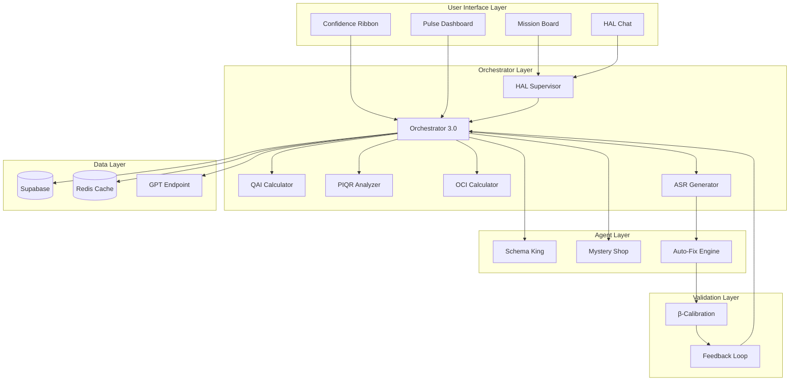
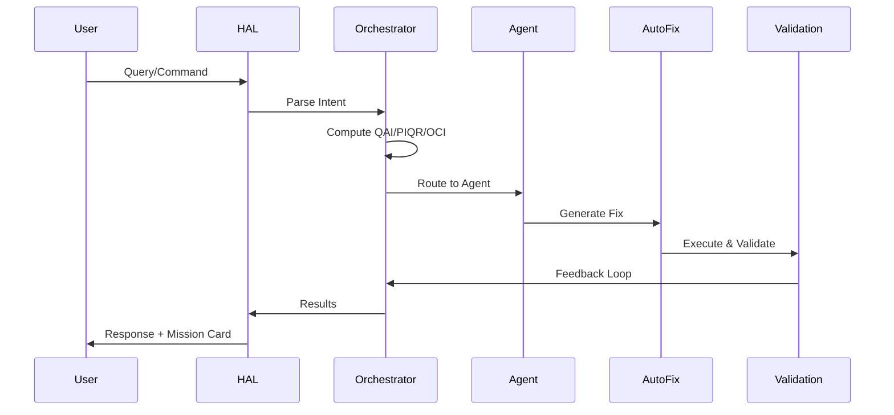
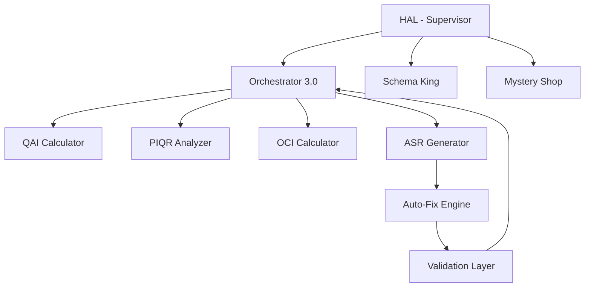
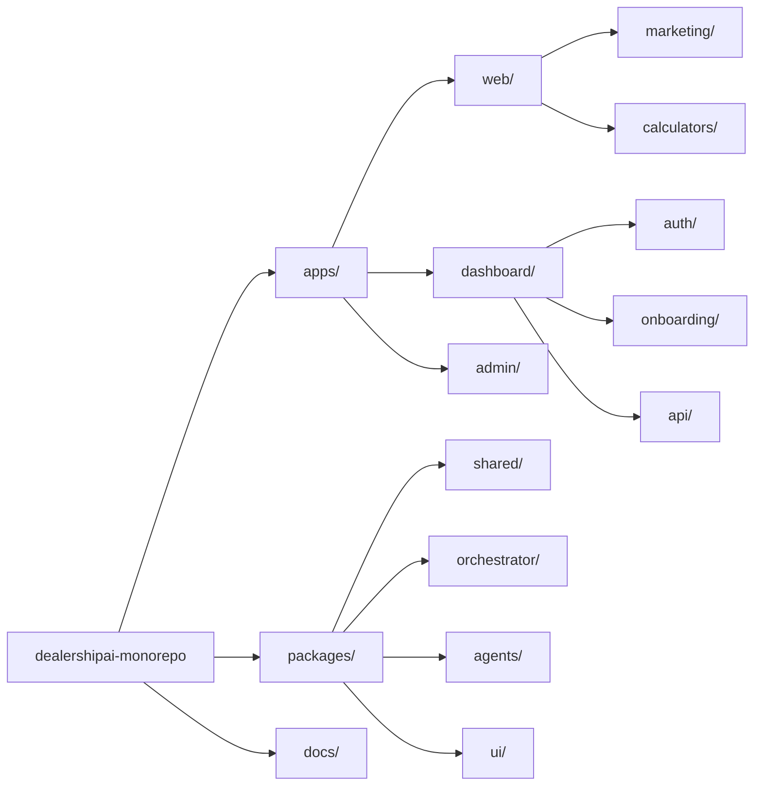
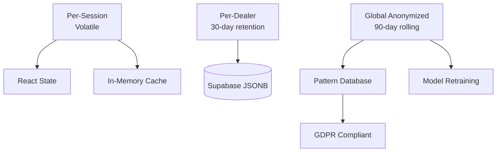
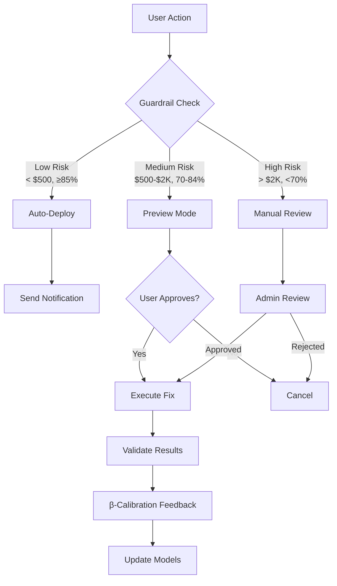
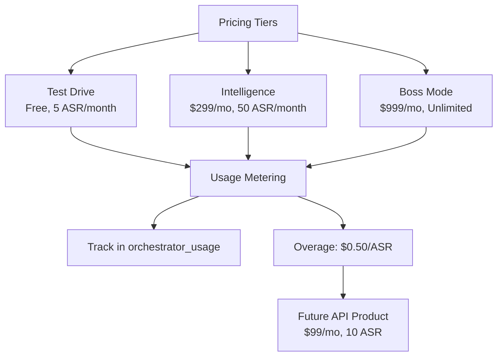

# Cognitive Ops Platform — Architecture Diagram

## System Architecture Overview



## Data Flow



## Agent Hierarchy



## Repository Structure



## Memory Architecture



## Execution Flow



## API Endpoint Map

```mermaid
graph LR
    API[API Routes]
    
    API --> ORCH_API[/api/orchestrator]
    API --> AUTOFIX[/api/ai/autofix]
    API --> ASR_API[/api/ai/asr]
    API --> SK_API[/api/agents/schema-king]
    API --> MS_API[/api/agents/mystery-shop]
    API --> SCORES[/api/ai-scores]
    API --> INTEL[/api/competitive-intel]
    API --> PRIORITIES[/api/priorities]
    API --> INTEGRATIONS[/api/integrations]
    
    ORCH_API --> ORCH[Orchestrator 3.0]
    AUTOFIX --> AF[Auto-Fix Engine]
    ASR_API --> ASR[ASR Generator]
    SK_API --> SK[Schema King]
    MS_API --> MS[Mystery Shop]
```

## Pricing & Metering



---

*These diagrams visualize the complete Cognitive Ops Platform architecture as defined in the Master Blueprint v1.*

