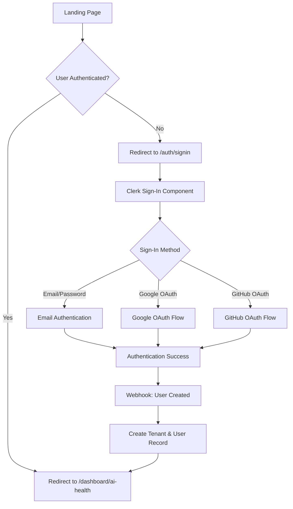
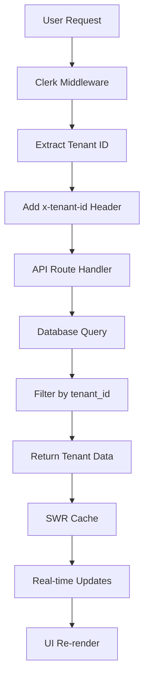

# 🏗️ DealershipAI Architecture & Journey Mapping Review

## 📋 **System Overview**

DealershipAI is an enterprise SaaS platform for automotive dealerships with AI visibility analytics, supporting multi-tenancy with 4-tier RBAC and handling 5,000+ dealerships.

---

## 🏛️ **Architecture Stack**

### **Frontend Layer**
- **Framework**: Next.js 14 with App Router
- **Language**: TypeScript
- **Styling**: Tailwind CSS
- **State Management**: SWR for real-time data
- **Authentication**: Clerk with multi-tenant support
- **UI Components**: Custom components with Lucide icons

### **Backend Layer**
- **API**: Next.js API Routes (app/api/.../route.ts)
- **Database**: PostgreSQL with Supabase
- **ORM**: Custom database wrapper (db.ts)
- **Authentication**: Clerk middleware with tenant isolation
- **Caching**: SWR with intelligent refresh strategies

### **Infrastructure**
- **Deployment**: Vercel with auto-deployment
- **Database**: Supabase with Row-Level Security (RLS)
- **Monitoring**: Built-in error tracking and logging
- **Scaling**: Serverless functions with edge caching

---

## 🗺️ **User Journey Mapping**

### **1. Authentication Journey**



### **2. Dashboard Navigation Journey**

```mermaid
graph TD
    A[/dashboard/ai-health] --> B[Tab Navigation]
    B --> C{Selected Tab}
    
    C -->|AI Health| D[Real-time Metrics]
    C -->|Website| E[Website Analytics]
    C -->|Schema| F[Schema Validation]
    C -->|Reviews| G[Review Management]
    C -->|War Room| H[Competitive Intel]
    C -->|Settings| I[User Preferences]
    
    D --> J[SWR Data Fetching]
    E --> J
    F --> J
    G --> J
    H --> J
    I --> J
    
    J --> K{Data Status}
    K -->|Loading| L[Loading Spinner]
    K -->|Success| M[Render Data]
    K -->|Error| N[Error Boundary]
    
    L --> O[Auto-refresh every 30s]
    M --> O
    N --> P[Retry Button]
    P --> J
```

### **3. Multi-Tenant Data Flow**



---

## 🏢 **Multi-Tenant Architecture**

### **Tenant Hierarchy**
```
SuperAdmin (System-wide)
├── Enterprise Admin (Up to 350 rooftops)
│   ├── Dealership Admin (Single dealership)
│   └── User (View-only access)
└── Dealership Admin (Single dealership)
    └── User (View-only access)
```

### **Data Isolation Strategy**
- **Row-Level Security (RLS)**: Database-level tenant isolation
- **Middleware Filtering**: Request-level tenant validation
- **API Route Protection**: Server-side tenant checks
- **Client-Side Validation**: UI-level permission checks

---

## 📊 **Dashboard Architecture**

### **Route Structure**
```
app/
├── (dashboard)/
│   ├── dashboard/
│   │   ├── layout.tsx          # Shared tab navigation
│   │   ├── page.tsx            # Redirect to ai-health
│   │   ├── ai-health/page.tsx  # Real-time AI monitoring
│   │   ├── website/page.tsx    # Website analytics
│   │   ├── schema/page.tsx     # Schema validation
│   │   ├── reviews/page.tsx    # Review management
│   │   ├── war-room/page.tsx   # Competitive intelligence
│   │   └── settings/page.tsx   # User preferences
│   └── [dealerId]/             # Dealer-scoped routes (optional)
└── api/
    ├── ai-health/route.ts      # AI health metrics
    ├── website/route.ts        # Website data
    ├── schema/route.ts         # Schema validation
    ├── reviews/route.ts        # Review analytics
    ├── war-room/route.ts       # Competitive data
    ├── settings/route.ts       # User settings
    └── dealers/[dealerId]/     # Dealer-specific APIs
```

### **Data Flow Architecture**
```
User Interface (React Components)
    ↓
SWR Hooks (Real-time data fetching)
    ↓
API Routes (Next.js API handlers)
    ↓
Database Wrapper (db.ts)
    ↓
Supabase (PostgreSQL with RLS)
```

---

## 🔄 **Real-Time Data Strategy**

### **SWR Configuration**
- **Critical Data**: 30-second refresh (AI Health, Reviews, War Room)
- **Standard Data**: 60-second refresh (Website, Schema, Settings)
- **Auto-revalidation**: On focus, reconnect, and manual refresh
- **Error Recovery**: Exponential backoff with retry limits

### **Caching Strategy**
- **Deduplication**: 10-30 second intervals
- **Optimistic Updates**: Instant UI updates with background sync
- **Error Boundaries**: Graceful error handling with retry options
- **Loading States**: Professional skeleton screens

---

## 🛡️ **Security Architecture**

### **Authentication Flow**
1. **Clerk Integration**: Enterprise-grade SSO
2. **Multi-tenant Support**: Organization-based access control
3. **Role-Based Access**: 4-tier permission system
4. **Webhook Sync**: Automatic user/tenant synchronization

### **Data Protection**
- **Tenant Isolation**: Complete data separation
- **RLS Policies**: Database-level security
- **API Validation**: Server-side tenant checks
- **Error Sanitization**: No sensitive data in error messages

---

## 📈 **Performance Architecture**

### **Optimization Strategies**
- **Server-Side Rendering**: Next.js App Router
- **Edge Caching**: Vercel edge functions
- **Database Indexing**: Optimized queries
- **Lazy Loading**: Component-level code splitting
- **Image Optimization**: Next.js image optimization

### **Monitoring & Observability**
- **Error Tracking**: Comprehensive error boundaries
- **Performance Monitoring**: Built-in Vercel analytics
- **Database Monitoring**: Supabase performance insights
- **User Analytics**: Clerk user behavior tracking

---

## 🚀 **Deployment Architecture**

### **CI/CD Pipeline**
```
Git Commit → Vercel Auto-Deploy → Production
    ↓
Environment Variables → Database Migration → Health Check
    ↓
Feature Flags → A/B Testing → Rollback Capability
```

### **Environment Strategy**
- **Development**: Local development with hot reload
- **Preview**: Branch-based preview deployments
- **Production**: Main branch auto-deployment
- **Staging**: Manual staging environment

---

## 🔮 **Future Architecture Considerations**

### **Scalability Enhancements**
- **Microservices**: Break down monolithic API routes
- **Event-Driven**: Implement event sourcing for real-time updates
- **CDN Integration**: Global content delivery
- **Database Sharding**: Horizontal scaling for large tenants

### **Feature Additions**
- **Real-time Collaboration**: WebSocket integration
- **Advanced Analytics**: Data warehouse integration
- **AI/ML Pipeline**: Custom model training
- **Mobile App**: React Native companion app

---

## 📋 **Current Status & Next Steps**

### **✅ Completed**
- Multi-tenant architecture with Clerk
- Real-time dashboard with SWR
- Comprehensive error handling
- Production-ready deployment
- Tab-based navigation system

### **🔄 In Progress**
- OAuth provider configuration
- Multi-tenant organization setup
- Webhook synchronization

### **📋 Next Steps**
- Complete Clerk dashboard configuration
- Add remaining dashboard page content
- Implement dealer-scoped routing
- Add advanced analytics features
- Set up monitoring and alerting

---

## 🎯 **Key Success Metrics**

### **Technical Metrics**
- **Uptime**: 99.9% availability target
- **Response Time**: <200ms API response
- **Error Rate**: <0.1% error rate
- **User Satisfaction**: >4.5/5 rating

### **Business Metrics**
- **User Adoption**: 80% monthly active users
- **Feature Usage**: 70% feature adoption rate
- **Customer Retention**: 95% annual retention
- **Revenue Growth**: 20% quarterly growth

This architecture provides a solid foundation for scaling DealershipAI to serve thousands of dealerships with enterprise-grade reliability and performance.
