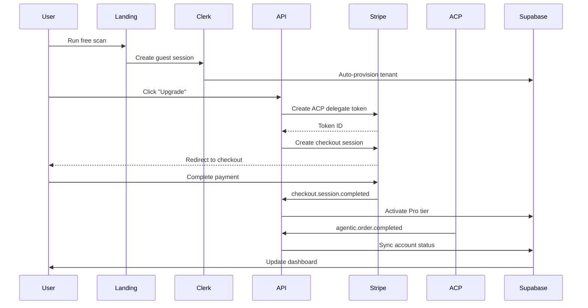

# ACP-Enabled PLG Integration Guide

## Overview

Complete integration guide for Agentic Commerce Protocol (ACP) with DealershipAI's Product-Led Growth funnel.

**Version:** 1.0.0
**Last Updated:** 2025-11-01

## Architecture

### PLG Flow

| Phase | Event Trigger | Tech Stack | Purpose |
|-------|--------------|------------|---------|
| 1️⃣ **Discover** | Visitor runs free scan | Clerk (guest) → Supabase | Capture lead + auto-provision tenant |
| 2️⃣ **Try** | Trial data unlocks | Stripe → ACP Checkout | Activate Test Drive tier |
| 3️⃣ **Buy** | User/Agent clicks Upgrade | ChatGPT/Agent → ACP → Stripe SPT | Instant conversion |
| 4️⃣ **Retain** | Usage or renewal | Webhook → Supabase → Pulse | Churn prevention + usage billing |

### Integration Points



## Environment Variables

### Required

```bash
# App
NEXT_PUBLIC_URL=https://dealershipai.com
NEXT_PUBLIC_APP_URL=https://dash.dealershipai.com

# Stripe
STRIPE_SECRET_KEY=sk_live_xxx
STRIPE_WEBHOOK_SECRET=whsec_xxx
STRIPE_PRICE_ID_PRO=price_xxx  # $499/mo subscription
STRIPE_PRICE_ID_ENTERPRISE=price_xxx  # Optional

# Supabase
NEXT_PUBLIC_SUPABASE_URL=https://xxx.supabase.co
SUPABASE_SERVICE_ROLE_KEY=eyJxxx

# Clerk
CLERK_SECRET_KEY=sk_live_xxx
CLERK_PUBLISHABLE_KEY=pk_live_xxx
CLERK_WEBHOOK_SECRET=whsec_xxx

# ACP (Agentic Commerce Protocol)
ACP_MERCHANT_ID=dealershipai
ACP_WEBHOOK_SECRET=xxx  # From ACP dashboard
```

## API Routes

### 1. Checkout Session Creation

**File:** `app/api/checkout/session/route.ts`

```typescript
// Creates Stripe Checkout Session with ACP delegate token
POST /api/checkout/session
{
  "plan": "pro",
  "domain": "example-dealer.com",
  "company": "Example Dealership"
}

Response:
{
  "url": "https://checkout.stripe.com/xxx",
  "sessionId": "cs_xxx",
  "acpTokenId": "spt_tok_xxx"
}
```

**Features:**
- ✅ ACP delegate payment token creation
- ✅ 14-day free trial
- ✅ Clerk user authentication
- ✅ Metadata tracking (userId, plan, domain)

### 2. Stripe Webhook Handler

**File:** `app/api/stripe/webhook/route.ts`

Handles Stripe events:
- `checkout.session.completed` - Activate subscription
- `customer.subscription.updated` - Update tier
- `customer.subscription.deleted` - Downgrade to free

### 3. ACP Webhook Handler

**File:** `app/api/webhooks/acp/route.ts`

Handles ACP events:
- `agentic.order.created` - Track order initiation
- `agentic.order.completed` - Activate Pro tier
- `agentic.order.canceled` - Cancel order
- `agentic.order.refunded` - Process refund

### 4. Clerk Webhook Handler

**File:** `app/api/clerk/webhook/route.ts`

Handles Clerk events:
- `user.created` - Auto-provision tenant in Supabase

## Supabase Schema

### Tables

```sql
-- Tenants (multi-tenant accounts)
create table tenants (
  id uuid primary key default gen_random_uuid(),
  user_id text unique not null,
  email text,
  plan text not null default 'FREE',  -- FREE, PRO, ENTERPRISE
  status text not null default 'active',  -- active, canceled, suspended
  created_at timestamptz not null default now(),
  updated_at timestamptz not null default now()
);

-- Orders (ACP and Stripe orders)
create table orders (
  id uuid primary key default gen_random_uuid(),
  user_id text not null,
  order_id text unique,
  sku text not null,
  amount integer not null,
  currency text not null default 'USD',
  source text not null,  -- stripe, agentic
  acp_token text,
  customer_id text,
  subscription_id text,
  status text not null,  -- pending, completed, canceled, refunded
  metadata jsonb,
  created_at timestamptz not null default now(),
  completed_at timestamptz,
  canceled_at timestamptz,
  refunded_at timestamptz,
  refund_amount integer
);

-- Events (audit log for all lifecycle events)
create table events (
  id uuid primary key default gen_random_uuid(),
  user_id text,
  type text not null,  -- lead.created, trial.started, conversion.completed, etc.
  source text,  -- clerk, stripe, acp, manual
  payload jsonb,
  created_at timestamptz not null default now()
);

-- Pulse Events (for dashboard feed)
create table pulse_events (
  id uuid primary key default gen_random_uuid(),
  user_id text not null,
  event_type text not null,
  event_data jsonb,
  created_at timestamptz not null default now()
);

-- PLG Metrics (aggregated KPIs)
create table plg_metrics (
  id uuid primary key default gen_random_uuid(),
  metric_name text not null,
  metric_data jsonb,
  created_at timestamptz not null default now()
);

-- Daily KPI Rollups
create table kpi_daily (
  day date primary key,
  signups int not null default 0,
  trials int not null default 0,
  paid int not null default 0,
  acp_orders int not null default 0,
  agent_sessions int not null default 0,
  activation_rate decimal(5,2),
  trial_to_paid_rate decimal(5,2),
  agentic_conversion_rate decimal(5,2)
);
```

### RLS Policies

```sql
alter table tenants enable row level security;
create policy tenants_self on tenants
  for select using (auth.uid()::text = user_id);

alter table orders enable row level security;
create policy orders_self on orders
  for select using (auth.uid()::text = user_id);

alter table events enable row level security;
create policy events_self on events
  for select using (auth.uid()::text = user_id);
```

### Functions

```sql
-- Sync account status from webhooks
create or replace function public.sync_account_status(event jsonb)
returns void language plpgsql security definer as $$
begin
  update tenants
  set
    plan = coalesce(event->>'plan', plan),
    status = coalesce(event->>'status', status),
    updated_at = now()
  where user_id = event->>'userId';

  if not found then
    insert into tenants (user_id, email, plan, status)
    values (
      event->>'userId',
      event->>'email',
      coalesce(event->>'plan', 'FREE'),
      coalesce(event->>'status', 'active')
    )
    on conflict (user_id) do update
    set
      plan = excluded.plan,
      status = excluded.status,
      updated_at = now();
  end if;

  -- Insert event log
  insert into events (user_id, type, source, payload)
  values (
    event->>'userId',
    'account.status_changed',
    event->>'source',
    event
  );
end;
$$;
```

## KPIs & Metrics

### Key Performance Indicators

| KPI | Formula | Source | Target |
|-----|---------|--------|--------|
| **Activation Rate** | `paid_signups / total_signups` | tenants, orders | >15% |
| **Trial-to-Paid %** | `paid_conversions / trials` | events, stripe | >25% |
| **Agentic Conversion Rate (ACR)** | `acp_checkouts / agent_sessions` | acp webhooks | >8% |
| **Zero-Friction Revenue** | `sum(amount where source='acp')` | orders | Track trend |
| **Refund Latency** | `avg(refunded_at - completed_at)` | orders | <7 days |
| **MRR** | `sum(amount) / 100 where status='active'` | orders, stripe | Growth |
| **Churn Rate** | `cancellations / active_subscriptions` | stripe | <5% |

### Dashboard Query Examples

```sql
-- Activation Rate (last 30 days)
select
  count(*) filter (where plan != 'FREE') * 100.0 / count(*) as activation_rate
from tenants
where created_at > now() - interval '30 days';

-- Trial-to-Paid Conversion
select
  count(*) filter (where o.status = 'completed') * 100.0 /
  count(*) filter (where e.type = 'trial.started') as trial_to_paid_rate
from events e
left join orders o on o.user_id = e.user_id
where e.created_at > now() - interval '30 days';

-- Agentic Conversion Rate
select
  count(*) filter (where source = 'agentic') * 100.0 /
  count(*) as acr
from orders
where created_at > now() - interval '30 days';

-- MRR by Source
select
  source,
  sum(amount) / 100 as mrr
from orders
where status = 'completed'
  and created_at >= date_trunc('month', now())
group by source;
```

## ACP Manifest

**File:** `public/acp_manifest.json`

```json
{
  "merchant": {
    "id": "dealershipai",
    "name": "DealershipAI",
    "capabilities": [
      "checkout:create",
      "checkout:update",
      "checkout:complete"
    ],
    "webhooks": {
      "order": "/api/webhooks/acp"
    },
    "products": [
      {
        "sku": "DIY_PRO_499",
        "name": "DealershipAI Pro",
        "price": 49900,
        "currency": "USD",
        "type": "subscription",
        "features": [
          "Unlimited AI scans",
          "Competitive intelligence",
          "Custom reports",
          "API access"
        ]
      }
    ]
  }
}
```

## Testing

### 1. Local Development

```bash
# Start Stripe webhook listener
stripe listen --forward-to localhost:3000/api/stripe/webhook

# Test checkout flow
curl -X POST http://localhost:3000/api/checkout/session \
  -H "Authorization: Bearer YOUR_CLERK_TOKEN" \
  -H "Content-Type: application/json" \
  -d '{"plan":"pro","domain":"test-dealer.com"}'
```

### 2. Simulate ACP Webhook

```bash
curl -X POST http://localhost:3000/api/webhooks/acp \
  -H "Content-Type: application/json" \
  -H "x-acp-signature: YOUR_SIGNATURE" \
  -H "x-acp-timestamp: $(date +%s)" \
  -d '{
    "event": "agentic.order.completed",
    "data": {
      "orderId": "acp_order_test123",
      "customerId": "cus_test123",
      "subscriptionId": "sub_test123",
      "amount": 49900,
      "currency": "USD",
      "metadata": {
        "userId": "user_test123",
        "plan": "pro",
        "domain": "test-dealer.com"
      }
    }
  }'
```

### 3. Verify Supabase

```sql
-- Check tenant activation
select * from tenants where user_id = 'user_test123';

-- Check order creation
select * from orders where user_id = 'user_test123';

-- Check event log
select * from events where user_id = 'user_test123' order by created_at desc;

-- Check PLG metrics
select * from plg_metrics order by created_at desc limit 10;
```

## Deployment Checklist

- [ ] Add all environment variables to Vercel
- [ ] Configure Stripe webhook endpoint: `https://dealershipai.com/api/stripe/webhook`
- [ ] Configure ACP webhook endpoint: `https://dealershipai.com/api/webhooks/acp`
- [ ] Configure Clerk webhook endpoint: `https://dealershipai.com/api/clerk/webhook`
- [ ] Apply Supabase migrations
- [ ] Enable RLS policies
- [ ] Register with ACP at developers.openai.com
- [ ] Test checkout flow end-to-end
- [ ] Test ACP webhook integration
- [ ] Set up monitoring (Sentry, LogRocket)
- [ ] Configure GA4 events for funnel tracking
- [ ] Set up daily KPI cron job

## Monitoring & Alerts

### Key Events to Track

```typescript
// GA4 Events
analytics.track('checkout_initiated', { plan, source: 'web' });
analytics.track('checkout_completed', { plan, revenue, source });
analytics.track('acp_order_completed', { orderId, amount });
analytics.track('subscription_canceled', { plan, reason });
```

### Sentry Error Tracking

```typescript
Sentry.captureException(error, {
  tags: {
    feature: 'checkout',
    userId,
    plan
  }
});
```

## Support & Resources

- **Stripe Docs:** https://stripe.com/docs/api
- **ACP Docs:** https://platform.openai.com/docs/agentic-commerce
- **Clerk Docs:** https://clerk.com/docs
- **Supabase Docs:** https://supabase.com/docs

## Changelog

### v1.0.0 (2025-11-01)
- Initial ACP integration
- Checkout session with delegate tokens
- Webhook handlers (Stripe, ACP, Clerk)
- Supabase schema and functions
- KPI tracking and dashboards
